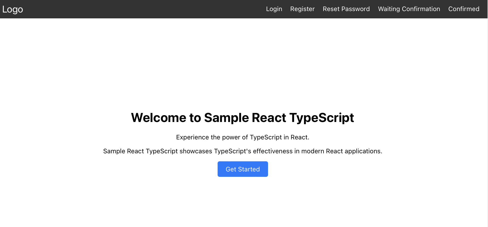

# My React Application



My React Application is a web application built with React that provides various pages for user authentication and account management.

## Pages

- **Home**: Landing page of the application.
- **Login**: Allows users to log in to their accounts.
- **Register**: Allows new users to create an account.
- **Reset Password**: Allows users to reset their passwords.
- **Waiting Confirmation**: Informs users to check their email for confirmation.
- **Confirmation**: Displays a confirmation message after successful registration.

## Installation

To run this application locally, follow these steps:

1. Clone this repository to your local machine.
2. Navigate to the project directory.
3. Install dependencies using npm:

   ```
   npm install
   ```

4. Start the development server:

   ```
   npm start
   ```

5. Open [http://localhost:3000](http://localhost:3000) in your browser to view the app.

## License

This project is licensed under the [MIT License](LICENSE).
